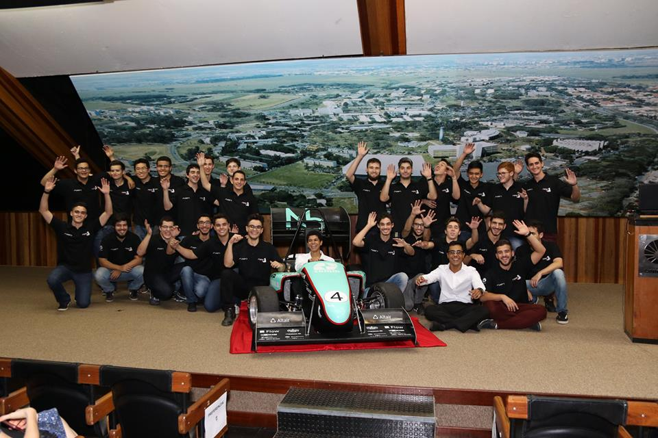

---
# About widget.
widget: "project"  # See https://sourcethemes.com/academic/docs/page-builder/
#headless : false  # This file does not represent a page section.
active : true  # Activate this widget? true/false
weight : 50  # Order that this section will appear in.

# Project title.
title : "Formula Student/SAE - 2017"

# Date this page was created.
date : 2019-02-27T00:00:00

# Project summary to display on homepage.
summary : "Advisor Member"

# Tags: can be used for filtering projects.
tags : ["Formula Student-SAE"]

# Optional external URL for project (replaces project detail page).
external_link : ""

# Slides (optional).
#   Associate this project with Markdown slides.
#   Simply enter your slide deck's filename without extension.
#   E.g. `slides = "example-slides"` references 
#   `content/slides/example-slides.md`.
#   Otherwise, set `slides = ""`.
slides : ""

# Links (optional).
url_pdf : ""
url_slides : ""
url_video : ""
url_code : ""

# Custom links (optional).
#   Uncomment line below to enable. For multiple links, use the form `[{...}, {...}, {...}]`.
#url_custom : [{icon_pack = "fab", icon="twitter", name="Follow", url = "https://twitter.com/georgecushen"}]

# Featured image
# To use, add an image named `featured.jpg/png` to your project's folder. 
image:
  # Caption (optional)
  caption : "F2017"
  
  # Focal point (optional)
  # Options: Smart, Center, TopLeft, Top, TopRight, Left, Right, BottomLeft, Bottom, BottomRight
  focal_point : "Center"
  
  preview_only: false
  
# Choose the user profile to display
# This should be the username of a profile in your `content/authors/` folder.
# See https://sourcethemes.com/academic/docs/get-started/#introduce-yourself
author : "admin"
---

As a former member, I supported the new team leaders with advices in general decisions.

## Results
### 2017 - Formula SAE Brasil (40 teams):
* 2nd Position in the Cost and Manufaturing Event
* 5th Position in the Design Event
* 10th Position in the Presentation Event
* 10th Position in the Autocross Event
* 13th Position Overall
