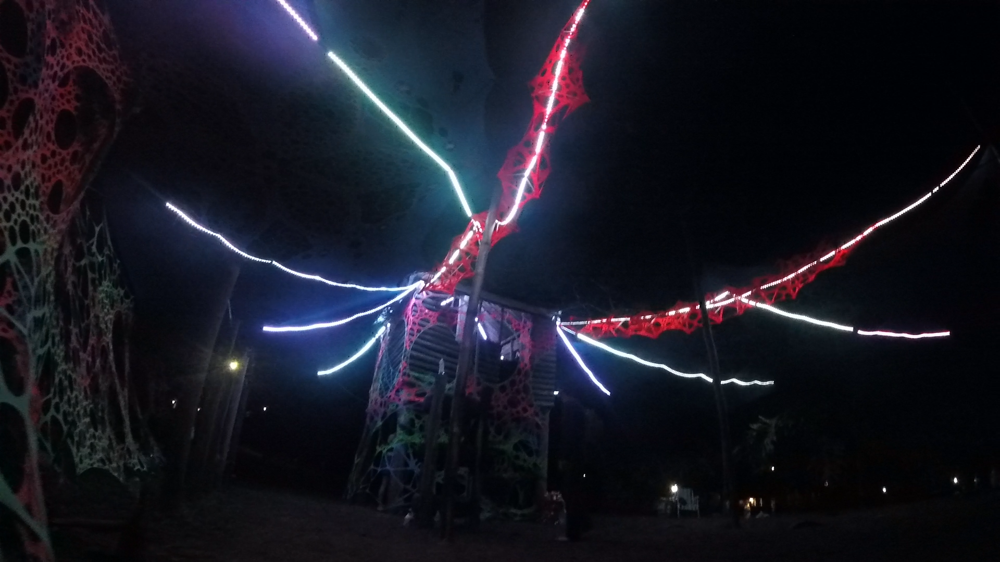
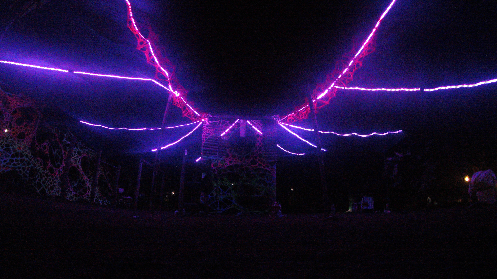

---
# About widget.
widget: "project"  # See https://sourcethemes.com/academic/docs/page-builder/
#headless : false  # This file does not represent a page section.
active : true  # Activate this widget? true/false
weight : 40  # Order that this section will appear in.

# Project title.
title : "Medooze"

# Date this page was created.
date : 2019-02-27T00:00:00

# Project summary to display on homepage.
summary : "Led Installation using a music reactive algorithm"

# Tags: can be used for filtering projects.
tags : ["Audio Analysis", "Art Installation", "Pure Data", "Raspberry Pi", "Led Strip", "Audio Visual", "Music Information Retrieval"]

# Optional external URL for project (replaces project detail page).
external_link : ""

# Slides (optional).
#   Associate this project with Markdown slides.
#   Simply enter your slide deck's filename without extension.
#   E.g. `slides = "example-slides"` references 
#   `content/slides/example-slides.md`.
#   Otherwise, set `slides = ""`.
slides : ""

# Links (optional).
url_pdf : ""
url_slides : ""
url_video : ""
url_code : ""

# Custom links (optional).
#   Uncomment line below to enable. For multiple links, use the form `[{...}, {...}, {...}]`.
#url_custom : [{icon_pack = "fab", icon="twitter", name="Follow", url = "https://twitter.com/georgecushen"}]

# Featured image
# To use, add an image named `featured.jpg/png` to your project's folder. 
image:
  # Caption (optional)
  caption : ""
  
  # Focal point (optional)
  # Options: Smart, Center, TopLeft, Top, TopRight, Left, Right, BottomLeft, Bottom, BottomRight
  focal_point : "Center"
  
  preview_only: false
  
# Choose the user profile to display
# This should be the username of a profile in your `content/authors/` folder.
# See https://sourcethemes.com/academic/docs/get-started/#introduce-yourself
author : "admin"
---

Medooze is a personal project developed by me and Gabriela Bittencourt, consisting of a smart lighting system. The algorithm developed by us analyses the music in real time to create synesthetic visual effects.

The installation was presented in a music festival: the audio from the DJ mixer was captured by an audio interface, and processed in a Pure Data patch. This patch simulated a fluid that was reacting to several audio features in real time.

The fluid positions were then mapped to a color palette, forming visual streams in a wave-like motion. Each particle of the fluid was then mapped to a corresponding Led in a strip. This information was sent through the network to a Raspberry Pi, which controlled 12 Led Strips.

<video width="505" height="364" controls>
  <source src="/project/medooze/Medooze_Demo.mp4" type="video/mp4">
Your browser does not support the video tag.
</video> 
(Music used in the demo video: So Let's Begin - Kognitif)

The total of 60m of Led Strips were placed above the dance floor, streaming out from the DJ cabine. You can see the infrastructure in the pictures below.

